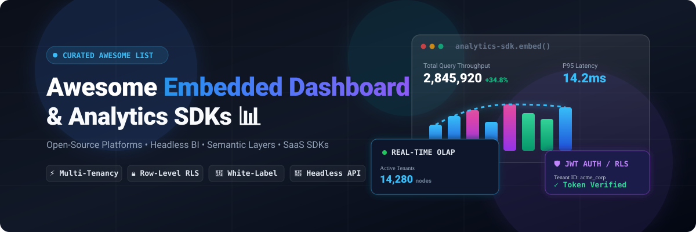

<p align="center">
  <a href="https://github.com/ishandutta2007/Awesome-Awesome-Awesome"></a>
  <a href="https://discord.gg/jc4xtF58Ve"></a>
  <a href="https://github.com/ishandutta2007/Awesome-Embedded-Dashboard-SDK/stargazers"></a>
  <a href="https://github.com/ishandutta2007/Awesome-Embedded-Dashboard-SDK/network/members"></a>
  <a href="https://github.com/ishandutta2007/Awesome-Embedded-Dashboard-SDK/pulls"></a>
  <a href="https://github.com/ishandutta2007/Awesome-Embedded-Dashboard-SDK/blob/main/LICENSE"></a>
  <a href="https://github.com/ishandutta2007"></a>
</p>

<p align="center">
  
</p>

# 📊 Awesome Embedded Dashboard SDK &amp; Analytics

> 🚀 A curated list of **Embedded Analytics, Embedded BI, Dashboard SDKs, White-Label Analytics Platforms, Headless Semantic Layers, and Open-Source Alternatives** for integrating interactive charts, customizable dashboards, and real-time data exploration directly into SaaS applications, client portals, internal tools, and multi-tenant software products.

---

## 🔍 Overview & SEO Keywords

**Embedded Dashboard SDKs** and **Embedded Analytics Platforms** allow software engineers, product managers, and data teams to deliver customer-facing analytics with native product UX. Key capabilities include:

* 📈 **Interactive Visualizations & Chart Builders** (React, Vue, Angular, Svelte, Web Components)
* 🏢 **Multi-Tenancy & Data Isolation** (Tenant IDs, Row-Level Security, Column-Level Security, Attribute-Based Access Control)
* 🔐 **Embedded Security & Authentication** (JWT Embed Tokens, Signed URLs, SSO, OAuth2, Guest Tokens)
* 🎨 **Full White-Labeling & UI Theming** (CSS Variables, Headless API, Custom Themes, Domain Masking)
* 🧠 **Headless Semantic Layers & Metrics APIs** (dbt, Cube, Malloy, Metrics as Code, Query Caching)
* ⚡ **High-Performance OLAP Backends** (ClickHouse, DuckDB, Apache Druid, Apache Pinot, Trino, RisingWave)

---

## 📑 Table of Contents

* [☁️ SaaS &amp; Hosted Embedded Analytics Platforms](#️-saas--hosted-embedded-analytics-platforms)
* [🌍 Open-Source BI &amp; Embedded Dashboard Repositories](#-open-source-bi--embedded-dashboard-repositories)
* [🧩 Open-Source Embedded Analytics Building Blocks](#-open-source-embedded-analytics-building-blocks)
* [🏗️ Embedded Analytics Architecture](#️-embedded-analytics-architecture)
* [🔐 Multi-Tenant Security Architecture](#-multi-tenant-security-architecture)
* [🧱 Modern Open-Source Embedded Analytics Stack](#-modern-open-source-embedded-analytics-stack)
* [🔌 Official Embedded SDK Code Examples](#-official-embedded-sdk-code-examples)
* [🔍 Commercial vs Open-Source Comparison](#-commercial-vs-open-source-comparison)
* [⭐ Star History](#-star-history)
* [🤝 How to Contribute](#-how-to-contribute)
* [⚠️ Disclaimer](#️-disclaimer)

---

## ☁️ SaaS &amp; Hosted Embedded Analytics Platforms

> 🌐 **Market Overview & Industry Structure:**
> The global **Embedded Analytics &amp; Embedded BI SDK** market is estimated at **$68.5 Billion to $78.2 Billion** (expanding at ~14.8% CAGR). The market structure is **moderately to highly fragmented** rather than a winner-take-all monopoly. While hyper-scalers (Microsoft Power BI, Google Looker, Salesforce Tableau) dominate broad internal enterprise BI, modern B2B SaaS software companies heavily distribute their spend across specialized developer-first headless SDKs (*Luzmo, Embeddable, GoodData, Bold BI, Explo, Quill*) and self-hosted open-source platforms (*Apache Superset, Metabase, Cube, ClickHouse*) to ensure custom UI styling, row-level security isolation, and predictable non-per-user margins.

*The table below is sorted by **Company Size (Market Cap / Valuation / Revenue)** in descending order:*

| Platform | Company Size (Valuation / Revenue / MCap) | Description | Primary Focus | Pricing (Starting Tier) | Free Tier / Trial Limit |
| :--- | :--- | :--- | :--- | :--- | :--- |
| [Power BI Embedded](https://azure.microsoft.com/products/power-bi-embedded) | **~$3.1 Trillion MCap** (Microsoft) | Microsoft Azure dedicated capacity service for embedding interactive Power BI reports and dashboards into web apps with "App Owns Data" security. | Enterprise Embedded BI | Azure A1 SKU capacity starts at $1.008/hour (~$735/month for 24/7 run, pausable when idle) | Azure 30-day free account ($200 credits) + free development embed tokens (non-production testing) |
| [Looker Embedded](https://cloud.google.com/looker) | **~$2.1 Trillion MCap** (Alphabet / Google) | Google Cloud enterprise embedded analytics platform leveraging LookML modeling, governed semantic layer, and Looker Embed SDK. | Enterprise BI, Embedded Analytics | Looker Core Standard starts at ~$35,000–$60,000/year (~$2,900/month) + user licenses (Viewer $30/mo, Standard $60/mo, Developer $125/mo) | No self-service free trial; evaluation instance / Proof of Concept (POC) available via Google Cloud sales |
| [Tableau Embedded Analytics](https://www.tableau.com/products/embedded-analytics) | **~$260 Billion MCap** (Salesforce) | Salesforce Tableau platform for integrating governed visual analytics, dashboards, and self-service exploration via Javascript Embedding API v3. | Enterprise Embedded BI | Embedded deployments start at ~$4,000–$10,000/year (or Creator seat at $75/user/month, Viewer at $35/user/month) | 14-day Tableau Cloud free trial &amp; 30-day Tableau Developer Program sandbox with full API access |
| [Qlik Embedded Analytics](https://www.qlik.com/us/products/qlik-embedded-analytics) | **~$10 Billion Valuation** (Thoma Bravo / $1B+ ARR) | Developer platform providing Qlik associative engine APIs, nebula.js visualization library, and multi-tenant cloud analytics. | Embedded BI | Qlik Cloud Standard starts at $825/month (25 GB data) / Premium for anonymous embedded access starts at $2,750/month (50 GB data) | 30-day full-featured free trial of Qlik Cloud Analytics (no credit card required) |
| [ThoughtSpot Embedded](https://www.thoughtspot.com/product/embedded) | **~$4.5 Billion Valuation** ($150M+ ARR) | Search-driven and GenAI-powered embedded analytics platform with Visual Embed SDK, custom actions, and developer playground. | AI Analytics, Embedded BI | ThoughtSpot Essentials starts at $1,250/month; Embedded enterprise plans start at custom quotes | Developer Plan is free for 1 year (proof-of-concept for up to 5 users, 25M data rows) + 30-day free trial |
| [Logi Symphony](https://insightsoftware.com/logi/) | **~$4.0 Billion Valuation** (insightsoftware / HG Capital) | Developer analytics suite uniting Logi Analytics, Dundas BI, and Izenda for embedded dashboards, visual composer, and pixel-perfect reports. | Embedded Analytics | Enterprise contracts start at ~$16,000–$25,000/year (~$1,330/month) | No self-service free trial; guided product demonstration and evaluation Proof of Concept (POC) on request |
| [Logi Analytics](https://insightsoftware.com/logi/) | **~$4.0 Billion Valuation** (insightsoftware / HG Capital) | Developer-oriented analytics platform for embedding custom dashboards, automated reporting, and backend data connectors. | Developer BI | Enterprise contracts start at ~$16,000/year (under insightsoftware / Logi Symphony family) | No self-service free trial; guided live demo and evaluation POC on request |
| [Yellowfin Embedded](https://www.yellowfinbi.com/) | **~$3.0+ Billion Valuation** (Idera Inc.) | Embedded BI platform featuring interactive dashboards, automated data discovery, data storytelling, and white-label SDKs. | Embedded BI | Starts at $19/user/month (or custom server core/OEM revenue-share starting ~$10,000/year) | 30-day full-feature free trial with direct data connectors + free Proof of Concept (POC) |
| [Sisense](https://www.sisense.com/) | **~$1.0+ Billion Valuation** (Unicorn) | Embedded analytics platform offering Compose SDK, React components, custom data models, and white-label multi-tenant governance. | Embedded Analytics, SaaS | Enterprise embedded contracts typically start at ~$20,000–$40,000/year (~$1,660/month) | Interactive "Test Drive" environment and 7-day to 30-day evaluation trial arranged via sales |
| [Pyramid Analytics](https://www.pyramidanalytics.com/) | **~$1.0 Billion Valuation** (Series E) | Decision intelligence and enterprise analytics platform featuring automated modeling, multi-tenant dashboard builder, and REST APIs. | Enterprise Analytics | Enterprise quote-based deployments start at ~$15,000–$30,000/year | Free Community Edition (limited to 3 users for non-production/POC); 30-day free trial of Enterprise Edition |
| [Phocas Embedded](https://www.phocassoftware.com/) | **~$500 Million Valuation** ($70M+ ARR) | Operational BI and embedded analytics software designed for ERP integration, financial statements, sales metrics, and customer portals. | Embedded Analytics | Starts at ~$1,000/month ($12,000/year) platform &amp; user fee + one-time onboarding fee | No self-service free trial; personalized evaluation demo and scoping session via sales |
| [Metabase Embedded](https://www.metabase.com/embedding/) | **~$300M–$500 Million Valuation** ($30M+ Series B) | Cloud &amp; self-hosted modular embedding SDK supporting interactive questions, drill-downs, dashboards, and automated JWT token signing. | Embedded BI, Self-Service Analytics | Pro plan with full interactive embedding &amp; SDK starts at $518–$575/month (includes 10 users; +$12/user/month) | 14-day free trial of Pro/Enterprise; self-hosted open-source version is free forever for basic iframe embedding |
| [Domo Everywhere](https://www.domo.com/platform/embedded-analytics) | **~$380 Million MCap** (Nasdaq: DOMO) | Cloud-native embedded BI system with automated ETL pipelines, card embedding, row-level filters, and partner portal sharing. | Embedded BI | Domo credit-based subscription starting at ~$30,000/year (~$2,500/month) for small teams with unlimited users | 30-day free trial (full platform access, unlimited users, sample datasets, no credit card required) |
| [GoodData Embedded](https://www.gooddata.com/) | **~$150M–$200 Million Valuation** ($100M+ VC) | Developer-centric headless BI platform with UI SDK (React), Web Components, Python SDK, and semantic metrics as code. | Embedded BI, Headless Analytics | Growth tier starts at ~$1,500/month (per-workspace model with unlimited users) | Free forever tier (development &amp; small teams, up to 5 workspaces, REST API) + 30-day full-feature trial |
| [Preset](https://preset.io/) | **~$150M–$250 Million Valuation** ($35.9M VC) | Fully managed Apache Superset cloud service providing enterprise security, automated upgrades, and embedded dashboard viewer tokens. | Superset Cloud | Preset Professional starts at $20/user/month + $500/month Embedded Dashboard Viewer pack (50 viewers) | Free Starter Plan forever (up to 5 users, 1 workspace, unlimited charts/dashboards) + 14-day Professional trial |
| [Apache Superset Embedded](https://superset.apache.org/) | **Open Source (Apache Foundation)** | Official `@superset-ui/embedded-sdk` for embedding production Superset dashboards via guest tokens and RLS filters. | Open-Source Embedded BI | Free &amp; Open Source ($0/month self-hosted under Apache 2.0); Managed cloud via Preset starts at $20/user/month + $500/month for 50 embedded viewers | Self-hosted is free forever with unlimited users; Preset hosted offers 14-day trial and 5-user free tier |
| [Reveal BI](https://www.revealbi.io/) | **~$100M+ Annual Revenue** (Infragistics) | Purpose-built native SDKs for Web, WPF, iOS, and Android to integrate interactive dashboards with fixed-price application licensing. | Embedded BI, White-Label | Starts at ~$8,995–$9,990/year flat fee per application (unlimited users) | 30-day free trial of SDK &amp; embedded dashboard features (no permanent free tier) |
| [Bold BI](https://www.boldbi.com/) | **~$80M+ Annual Revenue** (Syncfusion) | Complete embedded analytics solution with JavaScript embedding SDK, in-app dashboard designer, multi-tenancy, and 150+ connectors. | Embedded BI, SaaS | Embedded Cloud/Server plans start at ~$495–$795/month (flat platform pricing, no per-user fees) | Free Community License (free forever for teams with &lt;$1M revenue, ≤5 devs, ≤10 employees); 30-day full-feature free trial |
| [Luzmo](https://www.luzmo.com/) | **~$60M–$100 Million Valuation** (Series A) | Developer-friendly embedded analytics platform providing low-code dashboard building, Flex visual SDK, AI charts, and multi-tenant RLS. | Embedded Analytics, SaaS | Starts at $1,995/month (billed annually) platform fee | 10-day free trial with full platform access (no permanent free tier) |
| [Explo](https://www.explo.co/) | **~$50M–$80 Million Valuation** (Omni) | Customer-facing analytics platform for B2B SaaS with pre-built SQL chart widgets, report builders, and white-label client portals. | SaaS Embedded Analytics | Growth tier starts at $695/month ($8,350/year billed annually); Pro tier at $1,995/month | 7-day to 14-day free trial upon request (integrated under Omni) |
| [Embeddable](https://embeddable.com/) | **~$30M–$50 Million Valuation** (Seed) | Headless embedded analytics toolkit that gives developers full frontend freedom using custom React/Vue components with managed backend caching. | Developer-First Embedded BI | Flat monthly subscription starting at ~$1,500–$2,500/month (session-based, unlimited end users) | Guided Proof-of-Concept (POC) with standard 3-month break clause (no self-service trial) |
| [Quill](https://www.quill.co/) | **~$15M–$30 Million Valuation** (Seed) | Headless developer analytics infrastructure offering React SDK components, REST API, and native dashboard embedding without iframes. | SaaS Analytics | Developer analytics infrastructure starting at ~$1,000–$1,500/month | Free sandbox and developer evaluation environment available on request |
| [Holistics](https://www.holistics.io/) | **~$10M–$20 Million ARR** | Modern data-modeling &amp; BI platform offering code-based modeling (AMQL), reusable metrics, self-service exploration, and embedded dashboards. | Embedded BI | Entry tier starts at $800/month ($9,600/year billed annually); Standard tier at $1,000/month | 14-day free trial (extendable to 21 days upon request, no credit card required, includes Embedded mode) |
| [Holistics Embedded](https://www.holistics.io/embedded-analytics/) | **~$10M–$20 Million ARR** | Embedded analytics capabilities designed specifically for SaaS products to deploy multi-tenant customer-facing analytics with JWT authentication. | Embedded Analytics | Embedded plan starts at $800/month ($9,600/year billed annually) | 14-day free trial (extendable to 21 days upon request, no credit card required) |
| [Helical Insight](https://www.helicalinsight.com/) | **~$5M–$10 Million Revenue** | Developer-friendly BI and embedded analytics platform supporting ad-hoc reporting, workflow automation, and open APIs. | Embedded BI, Open Source | Enterprise Edition starts at custom annual subscription / ~$1,500/month (per-core or server license) | Community Edition is free forever (complete feature set including AI and embedding, with non-removable watermark); 30-day Enterprise POC trial |
| [DashboardFox](https://www.dashboardfox.com/) | **~$3M–$5 Million Revenue** | Self-hosted or hosted embedded dashboard and reporting software with one-time perpetual licensing and no recurring user fees. | Embedded Dashboards | Cloud Starter at $99/month (up to 5 Monthly Active Users) or Self-Hosted Perpetual license at $4,995 one-time | 7-day free trial (extendable to 14 days upon request, no credit card required) |

---

## 🌍 Open-Source BI &amp; Embedded Dashboard Repositories

> ⭐ **The Open-Source Embedded Ecosystem:**
> Self-hosting an open-source BI platform or composing an embedded analytics pipeline from open-source semantic layers, visualization grammars, and OLAP databases offers complete source-code ownership, no per-seat license taxes, and zero vendor lock-in.

*The table below is sorted by **GitHub Stars** in descending order:*

| Project | GitHub Stars Badge | Description | Primary Category | License |
| :--- | :--- | :--- | :--- | :--- |
| [D3.js](https://github.com/d3/d3) | [](https://github.com/d3/d3/stargazers) | Low-level JavaScript library for visualizing data using HTML, SVG, and CSS; foundation of modern web charting. | Visualization Framework | ISC |
| [Chart.js](https://github.com/chartjs/Chart.js) | [](https://github.com/chartjs/Chart.js/stargazers) | Simple yet flexible HTML5 Canvas charting library for lightweight, responsive embedded dashboard widgets. | Charting Library | MIT |
| [Apache Superset](https://github.com/apache/superset) | [](https://github.com/apache/superset/stargazers) | Modern enterprise BI platform with interactive dashboards, SQL Lab, and official `@superset-ui/embedded-sdk` for guest-token embedding. | ⭐ Embedded BI Platform | Apache-2.0 |
| [Grafana](https://github.com/grafana/grafana) | [](https://github.com/grafana/grafana/stargazers) | Open observability and visualization platform with extensive plugin ecosystem, panel embedding, and alerting. | Monitoring &amp; Dashboards | AGPL-3.0 |
| [Apache ECharts](https://github.com/apache/echarts) | [](https://github.com/apache/echarts/stargazers) | Powerful, highly performant charting and data visualization library with declarative canvas/SVG rendering and WebGL support. | ⭐ Visualization SDK | Apache-2.0 |
| [Metabase](https://github.com/metabase/metabase) | [](https://github.com/metabase/metabase/stargazers) | Intuitive open-source BI platform offering questions, dashboards, interactive drill-downs, and modular React embedding SDK. | ⭐ Embedded Dashboards | AGPL-3.0 |
| [ClickHouse](https://github.com/ClickHouse/ClickHouse) | [](https://github.com/ClickHouse/ClickHouse/stargazers) | Ultra-fast column-oriented OLAP database management system powering real-time analytical queries for embedded dashboards. | Real-Time OLAP Backend | Apache-2.0 |
| [DuckDB](https://github.com/duckdb/duckdb) | [](https://github.com/duckdb/duckdb/stargazers) | High-performance in-process SQL OLAP database management system optimized for analytical queries and local embedded data applications. | Embedded Analytical DB | MIT |
| [Redash](https://github.com/getredash/redash) | [](https://github.com/getredash/redash/stargazers) | Open-source data visualization platform connecting to any database, enabling fast SQL querying, sharing, and dashboard embeds. | SQL Analytics / BI | BSD-2-Clause |
| [Recharts](https://github.com/recharts/recharts) | [](https://github.com/recharts/recharts/stargazers) | Redefined chart library built on React components and D3 submodules for building custom product dashboards. | React Chart Components | MIT |
| [Cube](https://github.com/cube-js/cube) | [](https://github.com/cube-js/cube/stargazers) | Universal semantic layer and headless analytics API for building custom customer-facing analytics with multi-tenant caching. | ⭐ Headless Semantic Layer | Apache-2.0 |
| [Plotly.js](https://github.com/plotly/plotly.js) | [](https://github.com/plotly/plotly.js/stargazers) | Declarative charting library built on D3.js and stack.gl, supporting 40+ statistical, financial, 3D, and geographic chart types. | Scientific &amp; Web Charts | MIT |
| [Tremor](https://github.com/tremorlabs/tremor) | [](https://github.com/tremorlabs/tremor/stargazers) | React library of Tailwind CSS components to build dashboard interfaces, KPI scorecards, charts, and metrics views. | Dashboard UI Components | Apache-2.0 |
| [Apache Druid](https://github.com/apache/druid) | [](https://github.com/apache/druid/stargazers) | High-performance, real-time analytics database engineered for sub-second streaming and event-driven embedded applications. | Real-Time OLAP Backend | Apache-2.0 |
| [Nivo](https://github.com/plouc/nivo) | [](https://github.com/plouc/nivo/stargazers) | Rich set of React visualization components built over D3 with SVG, HTML, and Canvas rendering support. | React Chart Components | MIT |
| [Trino](https://github.com/trinodb/trino) | [](https://github.com/trinodb/trino/stargazers) | Fast distributed SQL query engine for big data analytics across object storage, data lakes, and federated databases. | Federated SQL Engine | Apache-2.0 |
| [Vega](https://github.com/vega/vega) | [](https://github.com/vega/vega/stargazers) | Declarative format (visualization grammar) for creating, saving, and sharing interactive visualization designs. | Visualization Grammar | BSD-3-Clause |
| [RisingWave](https://github.com/risingwavelabs/risingwave) | [](https://github.com/risingwavelabs/risingwave/stargazers) | Distributed SQL streaming database designed for stateful stream processing and ultra-fresh real-time dashboard analytics. | Real-Time Streaming DB | Apache-2.0 |
| [Lightdash](https://github.com/lightdash/lightdash) | [](https://github.com/lightdash/lightdash/stargazers) | Open-source BI platform tightly coupled with dbt metrics, offering self-service exploration, SDK embedding, and governed models. | ⭐ SaaS Embedded Analytics | MIT |
| [Evidence](https://github.com/evidence-dev/evidence) | [](https://github.com/evidence-dev/evidence/stargazers) | Code-driven BI framework for building interactive data products and fast reports using SQL, Markdown, and custom components. | ⭐ Code-Based BI / Apps | MIT |
| [Rill Developer](https://github.com/rilldata/rill) | [](https://github.com/rilldata/rill/stargazers) | Fast, developer-friendly BI engine combining DuckDB and a BI frontend into a single binary for sub-second exploratory dashboards. | Developer BI Engine | Apache-2.0 |
| [Apache Pinot](https://github.com/apache/pinot) | [](https://github.com/apache/pinot/stargazers) | Real-time distributed OLAP datastore designed for low-latency analytics at extreme scale with streaming ingestion from Kafka/Pulsar. | Real-Time OLAP Backend | Apache-2.0 |
| [Observable Plot](https://github.com/observablehq/plot) | [](https://github.com/observablehq/plot/stargazers) | Free, open-source JavaScript library for exploratory data visualization and quick dashboard prototyping. | Visualization SDK | ISC |
| [Vega-Lite](https://github.com/vega/vega-lite) | [](https://github.com/vega/vega-lite/stargazers) | Concise high-level grammar for visual analysis, compiling concise JSON specifications into full Vega visualizations. | Visualization Grammar | BSD-3-Clause |
| [DuckDB-Wasm](https://github.com/duckdb/duckdb-wasm) | [](https://github.com/duckdb/duckdb-wasm/stargazers) | WebAssembly build of DuckDB providing client-side fast SQL analytics directly inside the user's browser. | In-Browser Analytics DB | MIT |
| [Malloy](https://github.com/malloydata/malloy) | [](https://github.com/malloydata/malloy/stargazers) | Experimental, modern data modeling and query language developed to compile clean SQL for semantic layers and data apps. | Semantic Data Language | Apache-2.0 |
| [JasperReports](https://github.com/TIBCOSoftware/jasperreports) | [](https://github.com/TIBCOSoftware/jasperreports/stargazers) | Mature open-source Java reporting engine capable of generating pixel-perfect paginated documents and embedded charts. | Embedded Reporting | LGPL-3.0 |
| [BIRT](https://github.com/eclipse-birt/birt) | [](https://github.com/eclipse-birt/birt/stargazers) | Eclipse Foundation open-source reporting and business intelligence system for Java EE and enterprise applications. | Embedded Reporting | EPL-2.0 |
| [Knowage](https://github.com/KnowageLabs/Knowage-Server) | [](https://github.com/KnowageLabs/Knowage-Server/stargazers) | Open-source enterprise analytics platform covering data exploration, KPI dashboards, location intelligence, and predictive models. | Enterprise BI Platform | AGPL-3.0 |
| [Pentaho Community](https://github.com/pentaho/pentaho-platform) | [](https://github.com/pentaho/pentaho-platform/stargazers) | Open-source BI platform offering data integration (Kettle/PDI), OLAP analysis, dashboards, and reporting modules. | Enterprise BI &amp; ETL | GPL-2.0 / LGPL-2.0 |
| [Helical Insight](https://github.com/helicalinsight/helicalinsight) | [](https://github.com/helicalinsight/helicalinsight/stargazers) | Open-source-friendly Java BI framework with complete self-service dashboard capabilities, custom workflows, and API embedding. | Embedded BI Framework | Apache-2.0 |

---

## 🧩 Open-Source Embedded Analytics Building Blocks

A modern embedded analytics architecture decouples the visual layer from the semantic layer and the underlying OLAP datastore:

```
┌──────────────────────────────────────────────────────────┐
│                   1. Frontend Dashboard Layer            │
│  Apache Superset SDK  │  Metabase React  │  Tremor / D3  │
└────────────────────────────┬─────────────────────────────┘
                             │
┌────────────────────────────▼─────────────────────────────┐
│                 2. Semantic / Metrics Layer              │
│       Cube.js       │     dbt Semantic     │   Malloy    │
└────────────────────────────┬─────────────────────────────┘
                             │
┌────────────────────────────▼─────────────────────────────┐
│                 3. Analytical Database Layer             │
│     ClickHouse      │       DuckDB         │    Druid    │
└──────────────────────────────────────────────────────────┘
```

### 📊 1. Complete Open-Source BI &amp; Dashboard Platforms
* **[Apache Superset](https://github.com/apache/superset)** — Enterprise scale, 40+ visualization plugins, SQL Lab, and official Embedded SDK.
* **[Metabase](https://github.com/metabase/metabase)** — User-friendly questions, self-service dashboard builder, and modular React embedding.
* **[Lightdash](https://github.com/lightdash/lightdash)** — Native dbt metrics integration, version-controlled analytics, and embedded charts.
* **[Grafana](https://github.com/grafana/grafana)** — Operational dashboards, time-series data, logs, traces, and embeddable panels.
* **[Redash](https://github.com/getredash/redash)** — Lightweight SQL query editor, parameters, visualizations, and iframe embeds.
* **[Evidence](https://github.com/evidence-dev/evidence)** — Markdown + SQL code-based BI for fast, version-controlled analytical apps.
* **[Rill](https://github.com/rilldata/rill)** — Developer-first fast exploratory BI built over DuckDB.
* **[Knowage](https://github.com/KnowageLabs/Knowage-Server)** — Modular enterprise suite for reporting, dashboards, and geospatial analytics.
* **[Helical Insight](https://github.com/helicalinsight/helicalinsight)** — Open-source Java-based BI framework with ad-hoc reporting.

---

### 🧠 2. Headless Analytics &amp; Semantic Layers
* **[Cube](https://github.com/cube-js/cube)** — Semantic layer, pre-aggregations, access control, and SQL/REST/GraphQL APIs for custom frontends.
* **[Malloy](https://github.com/malloydata/malloy)** — Modern data language for nested aggregations and semantic data modeling.
* **[Lightdash Semantic](https://github.com/lightdash/lightdash)** — Governed metrics layer synced directly with your dbt repository.

---

### 📈 3. Visualization Grammars &amp; UI Component SDKs
* **[Apache ECharts](https://github.com/apache/echarts)** — Rich declarative visualization library with GPU acceleration and animations.
* **[D3.js](https://github.com/d3/d3)** — Primitive DOM-driven visualization library for bespoke, tailor-made visual representations.
* **[Chart.js](https://github.com/chartjs/Chart.js)** — Canvas-based charts with responsive rendering and minimal footprint.
* **[Recharts](https://github.com/recharts/recharts)** — Composable declarative chart components built for React ecosystems.
* **[Tremor](https://github.com/tremorlabs/tremor)** — React &amp; Tailwind CSS dashboard components (KPI cards, bar lists, trackers).
* **[Plotly.js](https://github.com/plotly/plotly.js)** — High-level declarative chart library for scientific and financial dashboards.
* **[Nivo](https://github.com/plouc/nivo)** — D3-based modular React charts supporting SVG, Canvas, and SSR.
* **[Vega](https://github.com/vega/vega)** &amp; **[Vega-Lite](https://github.com/vega/vega-lite)** — Declarative visualization grammars with interactive filtering.
* **[Observable Plot](https://github.com/observablehq/plot)** — Concise charting API designed for exploratory visualization.

---

### 🗄️ 4. Analytical Databases &amp; Stream Engines (OLAP)
* **[ClickHouse](https://github.com/ClickHouse/ClickHouse)** — Blazing fast column-oriented DBMS for real-time analytical workloads.
* **[DuckDB](https://github.com/duckdb/duckdb)** — In-process analytical database engine; ideal for embedded micro-services and serverless analytics.
* **[DuckDB-Wasm](https://github.com/duckdb/duckdb-wasm)** — Client-side in-browser SQL engine for zero-server analytical computations.
* **[Apache Druid](https://github.com/apache/druid)** — Distributed real-time analytical datastore for event-driven dashboards.
* **[Apache Pinot](https://github.com/apache/pinot)** — Real-time distributed OLAP datastore for high-throughput user-facing analytics.
* **[Trino](https://github.com/trinodb/trino)** — Distributed SQL query engine for federated queries across multiple data sources.
* **[RisingWave](https://github.com/risingwavelabs/risingwave)** — SQL stream database for ultra-low latency real-time metric processing.
* **[PostgreSQL](https://github.com/postgres/postgres)** — Versatile relational database with powerful indexing and analytical extensions.

---

## 🏗️ Embedded Analytics Architecture

A modern, production-grade embedded analytics implementation separates user authentication, query processing, caching, and visualization:

```text
                               SaaS Host Application
                                       │
                                       ▼
                       ┌───────────────────────────────┐
                       │  Frontend Embedded UI / SDK   │
                       │ (React / Vue / Web Component) │
                       └───────────────┬───────────────┘
                                       │
                         Signed JWT / Guest Token Auth
                                       │
                                       ▼
                       ┌───────────────────────────────┐
                       │    Headless Analytics API     │
                       │     (Cube / Custom REST)      │
                       └───────────────┬───────────────┘
                                       │
                     Row-Level Security & Tenant Filter
                                       │
                                       ▼
                       ┌───────────────────────────────┐
                       │    Semantic / Metrics Layer   │
                       │     (Metrics as Code / dbt)   │
                       └───────────────┬───────────────┘
                                       │
                            Sub-Second SQL Query
                                       │
                                       ▼
                       ┌───────────────────────────────┐
                       │    Analytical Database (OLAP) │
                       │    ClickHouse / DuckDB / Lake │
                       └───────────────────────────────┘
```

---

## 🔐 Multi-Tenant Security Architecture

Multi-tenant B2B applications must guarantee strict data isolation so that each organization only accesses authorized datasets:

```text
                  SaaS User (tenant_id = "tenant_123")
                                   │
                                   ▼
                       Host Backend Authentication
                                   │
             Mint Short-Lived Signed JWT / Guest Token
          Claims: { user: "john", tenant: "tenant_123", role: "admin" }
                                   │
                                   ▼
                      Embedded Dashboard Frontend
                                   │
                      Pass Token via Authorization Header
                                   │
                                   ▼
                     Embedded Analytics / Semantic API
                                   │
                 Validate Signature & Enforce Row-Level Security
         WHERE tenant_id = 'tenant_123' AND department = 'finance'
                                   │
                                   ▼
                      Isolated Tenant Query Result
```

### Essential Security Practices:
* 🔑 **Short-Lived Embed Tokens:** Issue JWTs valid for 5–15 minutes with automated silent refresh.
* 🛡️ **Row-Level Security (RLS):** Inject tenant filtering criteria directly into the semantic query generator.
* 🚫 **No Client-Side SQL Generation:** Prevent clients from sending arbitrary SQL statements.
* 📜 **Attribute-Based Access Control (ABAC):** Filter dashboards based on user roles, regions, and permissions.
* 🕵️ **Audit Logs & Rate Limiting:** Track query volume and export events per tenant.

---

## 🧱 Modern Open-Source Embedded Analytics Stack

A battle-tested open-source stack for customer-facing dashboards:

```text
Frontend Layer
   ├── React / Next.js / Vue
   ├── Tailwind CSS + Tremor UI
   └── Apache ECharts / Recharts

Semantic & API Layer
   ├── Cube.js (Semantic Layer & Multi-Tenant Caching)
   └── dbt Core (Data Transformation & Modeling)

Database Layer
   ├── ClickHouse (Event Analytics & Time-Series OLAP)
   └── DuckDB (Aggregations & In-Memory Previews)

Infrastructure
   ├── Docker / Kubernetes
   └── GitHub Actions (CI/CD for Data Models)
```

---

## 🔌 Official Embedded SDK Code Examples

### ⚡ Apache Superset Embedded SDK

```javascript
import { embedDashboard } from "@superset-ui/embedded-sdk";

// Fetch guest token from your secure backend API
async function fetchGuestTokenFromBackend() {
  const res = await fetch("/api/analytics/guest-token", { method: "POST" });
  const data = await res.json();
  return data.guest_token;
}

// Embed Superset dashboard into DOM node
embedDashboard({
  id: "c8e44b80-1423-4d69-b52b-31d798abf19c",
  supersetDomain: "https://superset.internal.domain",
  mountPoint: document.getElementById("analytics-container"),
  fetchGuestToken: () => fetchGuestTokenFromBackend(),
  dashboardUiConfig: {
    hideTitle: true,
    hideTab: false,
    hideChartControls: true,
    filters: {
      expanded: true,
    },
  },
});
```

---

### ⚡ Metabase Modular React SDK

```jsx
import React from "react";
import { InteractiveDashboard, MetabaseProvider } from "@metabase/embedding-sdk-react";

export function CustomerAnalytics({ dashboardId, tenantToken }) {
  return (
    <MetabaseProvider instanceUrl="https://analytics.example.com" apiKey={tenantToken}>
      <div className="dashboard-wrapper">
        <InteractiveDashboard 
          dashboardId={dashboardId}
          withParameters={{ tenant_id: "acme_corp" }}
          fitToContent
        />
      </div>
    </MetabaseProvider>
  );
}
```

---

### ⚡ Cube.js Headless Semantic Query API

```javascript
import cubejs from "@cubejs-client/core";

const cubeApi = cubejs("TENANT_JWT_TOKEN", {
  apiUrl: "https://analytics-api.example.com/cubejs-api/v1",
});

// Query semantic layer for custom React visualization
const resultSet = await cubeApi.load({
  measures: ["Orders.totalRevenue", "Orders.count"],
  timeDimensions: [{
    dimension: "Orders.createdAt",
    granularity: "month",
    dateRange: "This Year",
  }],
});

const chartData = resultSet.chartPivot();
// Render chartData seamlessly with Apache ECharts / Tremor
```

---

## 🔍 Commercial vs Open-Source Comparison

| Capability | 🏢 Commercial SaaS SDKs | 🌍 Open-Source Self-Hosted Stack |
| :--- | :--- | :--- |
| **Time to Launch** | ⚡ Hours to Days (Turnkey) | 🛠️ Days to Weeks (Custom Setup) |
| **Cost Model** | 💳 Monthly/Annual Subscription ($500–$3,000+/mo) | 💻 Infrastructure &amp; Cloud Compute ($50–$300/mo) |
| **Per-User Margins** | ⚠️ Can scale with active seats/viewers | 🟢 Flat cost regardless of end-user count |
| **White-Label &amp; Theming** | 🎨 High (Configurable via UI or CSS) | ⭐ Complete (100% code &amp; DOM control) |
| **Multi-Tenancy** | 🔒 Native turnkey isolation | 🛡️ Configured via JWT, RLS &amp; Cube/Superset |
| **Data Privacy &amp; GDPR** | ☁️ Third-party SaaS vendor cloud | 🏛️ Complete data residency in your own VPC |
| **Source Code Access** | ❌ Proprietary closed-source | ⭐ 100% Open-Source (Apache, MIT, BSD) |
| **Custom Visualizations** | ⚠️ Vendor chart palette | 📈 Limitless (D3, ECharts, WebGL, Canvas) |
| **Enterprise Maintenance** | 🛠️ Managed by vendor | 👨‍💻 Maintained by internal DevOps/Data engineering |

---

## ⭐ Star History

[](https://star-history.dera.page/#ishandutta2007/Awesome-Embedded-Dashboard-SDK&type=date&legend=top-left)

---

## 🤝 How to Contribute

Contributions are warmly welcomed! Help improve this directory:

1. 🍴 **Fork this repository**.
2. 🌿 **Create a new branch**: `git checkout -b add/new-analytics-sdk`.
3. 📝 **Add your project** in the matching table or building-block category.
4. ⭐ For open-source projects, include the official repo link and star badge `[](https://github.com/owner/repo/stargazers)`.
5. 📊 For SaaS platforms, include specific starting tier pricing and explicit free tier / trial terms.
6. 🚀 **Submit a Pull Request** with a concise description of the tool.

---

## ⚠️ Disclaimer

This repository is a **curated educational directory and software landscape reference**, not a commercial endorsement.

Pricing, licenses, and product features may change over time. Verify current commercial terms, multi-tenant compliance, and licensing details directly with project maintainers and vendors before deploying into production applications.

---

<p align="center">
  <sub>Maintained with ❤️ by the open-source community. Star ⭐ this repo if you find it helpful!</sub>
</p>
